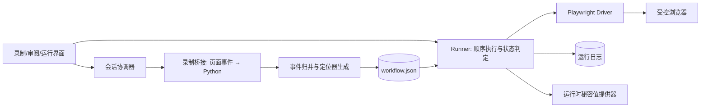

# 浏览器操作录制与回放：顶层架构

## 目标与边界

用户在程序打开的浏览器窗口中操作网页，程序生成可审阅、可编辑的工作流；用户运行时，程序按步骤定位页面元素、执行动作并记录结果。首版只覆盖**单个标签页、单个网页来源（origin）**的 `click`、`fill`、`hotkey`、`wait_for`。跨站登录、验证码、上传、拖拽和浏览器工具栏操作留给后续版本。

技术基线：Python 单进程程序 + Playwright 受控浏览器会话。Playwright 官方提供浏览器上下文脚本注入与 Python 回调绑定，可用于录制桥接；回放使用其语义定位和自动等待能力。[BrowserContext API](https://playwright.dev/python/docs/api/class-browsercontext)、[Locators](https://playwright.dev/python/docs/api/locators)

## 结构

| 模块 | 唯一职责 | 对外契约 |
| --- | --- | --- |
| 会话协调器 | 创建/关闭受控浏览器；录制与运行互斥 | `start_recording`、`stop_recording`、`run`、`cancel` |
| 录制桥接 | 接收 click、change、导航等候选事件；限制来源；不持久化原始按键流 | `CapturedEvent`（待审阅） |
| 归并与定位器生成 | 把候选事件变成语义步骤，检测唯一匹配与敏感输入 | `Workflow v1` |
| Runner | 顺序执行、超时、取消、结果分类；动作只调用一次 | [ra/core.py](ra/core.py) 中的 `Runner`、`Driver`、`Journal` |
| Playwright Driver | 将 `Target` 映射成 Playwright Locator，重新检查来源与目标，执行动作 | `Driver` 协议 |
| 工作流存储 | 保存用户审阅后的定义；唯一事实来源 | [ra/workflow.schema.json](ra/workflow.schema.json) |
| 运行日志 | 在动作前持久化 `action_started`；记录步骤结果 | `Journal` 协议 |

依赖方向：界面与 Playwright 适配器依赖工作流契约和 Runner；Runner 不导入浏览器库。工作流文件是可回放定义的唯一事实来源；运行日志只记录每次执行的事实，不反写工作流。

## 录制到回放

1. 用户指定允许录制的 origin，程序打开独立浏览器会话。页面脚本只发出操作候选；Python 端根据 Playwright 提供的调用来源再次核对页面、frame、origin，并限制消息大小。网页脚本可伪造事件，因此**候选事件必须经过用户审阅**。
2. 归并器把连续输入整理为一次 `fill`，按 `role+name`、`label`、`test_id`、稳定文本、必要时 CSS 的顺序生成候选定位器；每个候选都用当前页面实时计数，唯一匹配的才排在前。坐标不作为默认定位器。Playwright 自身的测试生成器也优先使用 role、text、test id，这可作为定位质量的参照。[Playwright test generator](https://playwright.dev/python/docs/codegen)
3. 密码及用户标记为敏感的字段只存 `secret_ref`。录制时不保存原始按键流；工作流和日志不保存秘密值。用户在审阅页确认普通文本、目标及必要的完成条件。
4. 会话协调器先打开工作流的 `start_url`；Runner 装载 `Workflow v1`，逐步检查 origin、等待唯一目标、写入 `action_started`、调用适配器一次、等待预期状态。等待目标可以轮询；`click/fill/hotkey` 在错误或结果不确定时不自动重试。
5. 对缺少 `expected` 的动作，报告 `completed_unverified`；动作后超时、驱动异常或取消均报告 `uncertain`，需人工检查页面后再运行。程序重启后不根据日志自动续跑。

## 关键决策

| 选项 | 收益 | 代价 | 决定 |
| --- | --- | --- | --- |
| 直接保存录制的屏幕坐标 | 录制简单 | 窗口大小和布局变化会误点 | 不采用 |
| 直接保存 Playwright codegen 生成的 Python | 很快得到原型 | 工作流难审阅/版本化；执行任意脚本难控制 | 仅用于定位质量参照 |
| 页面事件录制 + 结构化工作流 + Playwright 回放 | 步骤可审阅，失败可定位，适合后续编辑 | 需要录制归并器和定位器生成 | **首版采用** |
| 浏览器扩展 + Python 本地服务 | 可覆盖现有标签页 | 扩展权限、通信与安装复杂 | 仅当必须录制现有标签页时再选 |

本设计选择本地单进程模块化程序；没有远程服务或任务队列。首个纵向切片是：录制一个同来源页面上的 `click → fill → click → wait_for`，审阅 JSON，回放并得到逐步结果。

## 实现落位（后端与界面完成后回填）

| 契约 | 实现 | 说明 |
| --- | --- | --- |
| 会话协调器 | `ra/session.py` | 单一浏览器线程 + 任务队列；`idle/recording/review/running` 状态机，录制与回放互斥 |
| 录制桥接 | `ra/recorder.py`、`ra/ui/record_script.js` | `add_init_script` + `expose_binding`；Python 侧复核 frame/origin、限制消息大小、丢弃跨来源事件并记录原因 |
| 归并与定位器生成 | `ra/normalizer.py` | 连续输入合并、重复点击去重、`secret_ref` 命名、草稿编辑与重新校验 |
| Runner / 契约 | `ra/core.py` | 与平台无关；`resolve(target, timeout_s)` 让每次浏览器调用都有上限 |
| Playwright Driver | `ra/driver.py` | 定位返回可再解析的 Locator；动作前复核来源与唯一性；`<select>` 用 `select_option` |
| 工作流存储 | `ra/store.py` | JSON Schema + 执行语义双层校验；令牌参数拒绝保存 |
| 运行日志 | `ra/journal.py` | `action_started` 先落盘再执行；只含 ID、阶段、错误码与时间 |
| 秘密值 | `ra/secrets.py` | Windows DPAPI（当前用户）加密落盘，界面只看到引用名与长度 |
| 界面与外壳 | `ra/ui/`、`ra/shell.py`、`ra/api.py` | 单窗口应用：界面、后端、受控浏览器在同一进程；外壳用自带 Chromium 的 `--app` 窗口承载 UI，JS↔Python 走绑定桥 |

两处与初稿不同的实现决定，理由是可验证性：

- **应用窗口用自带 Chromium 的 `--app` 模式，而不是 WebView2。** 本机 WebView2 组件在 Python 侧无法完成 JS 注入与求值（`ICoreWebView2Controller` 返回 `E_NOINTERFACE`，`evaluate_js` 恒为 `None`），界面拿不到后端数据；改用程序本来就依赖的 Playwright Chromium 后，同一个窗口内的界面与后端桥接在自检中全部通过。
- **草稿里未重新校验的定位器标记为「未校验」而不是直接拒绝。** 从文件读回的工作流没有实时页面可比，计数未知；保存不被无意义地阻塞，而回放时 Driver 仍会在动作前复核唯一性，多匹配就停在动作之前。

`Workflow v1` 增加了一个可选字段 `name`（界面显示名）。兼容策略：旧文件缺省该字段仍通过 Schema，读取时回退为 `id`；写入时始终带上；其余字段未改动，因此已保存的工作流无需迁移。

## 质量门槛与风险

- 录制范围：其他 origin 的操作不进入工作流。多匹配或无法定位的目标必须显示为“需人工修复”，不得默默退化为坐标。
- 回放安全：测试应证明“动作抛错/完成条件超时”后动作调用次数仍为 1；origin 变化时下一动作调用次数为 0。
- 凭据：工作流与日志不得出现密码明文；录制时检查 `start_url` 的查询参数，含令牌的 URL 需改成运行时参数或拒绝保存。登录态文件按敏感数据处理，默认不导出/同步。[Playwright codegen 关于 storage state 的说明](https://playwright.dev/python/docs/codegen)
- 可用性：选 3 个代表性网页流程，各运行 10 次；逐步记录成功、失败和 `uncertain` 的原因，达到约定成功率后再扩大动作类型。
- 当前未知：目标网站的 DOM 稳定性、是否有跨来源 iframe、是否必须复用现有浏览器标签页。这些因素会决定录制适配器的具体实现。

## 架构校验（同一会话的独立视角复核）

`ARCH-PRIMARY`：核心边界为工作流契约、录制归并、回放策略、浏览器适配器；动作结果不确定时停止。

`ARCH-ADVERSARY`：检查了两处易被高估的能力：页面脚本事件并非可信事实；Playwright 的动作异常也不能证明动作没有发生。因此加入用户审阅、来源核对与 `uncertain` 状态。

`ARCH-SYNTH`：首版保留单来源/单标签页约束；跨来源和现有标签页录制需单独适配，不改变 Runner 契约。

`BASELINE | ra/core.py | expected: 用例策略与端口，不依赖浏览器框架 | observed: Runner、工作流模型、Driver/Journal/SecretStore 协议 | fit: align | patterns: [P-UC, P-PORT] | violations: [] | suggestion: 保持浏览器 API 只出现在适配器`

`VALIDATION | agents: [ARCH-PRIMARY, ARCH-ADVERSARY, ARCH-SYNTH] | agreement: high | unresolved: 1 | ready: yes`

这里的角色是同一会话内的顺序复核，尚未委派外部 agent；未决项是是否必须录制用户现有标签页。
